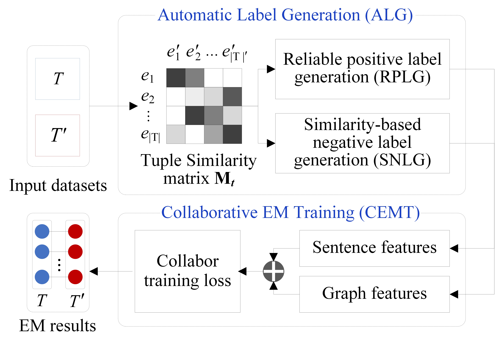

# **CollaborER: A Self-supervised Entity Resolution via Multi-features Collaboration**

CollaborER, a self-supervised entity resolution framework via multi-features collaboration. It is capable of (i) obtaining reliable ER results with zero human annotations and (ii) discovering adequate tuples’ features in a fault-tolerant manner. CollaborER consists of two phases, i.e., automatic label generation (ALG) and collaborative ER training (CERT). In the first phase, ALG is proposed to generate a set of positive tuple pairs and a set of negative tuple pairs. ALG guarantees the high quality of the generated tuples, and hence ensure the training quality of the subsequent CERT. In the second phase, CERT is introduced to learn the matching signals by discovering graph features and sentence features of tuples collaboratively.

For more technical details, see the [CollaborER: A Self-supervised Entity Resolution Framework using Multi-features Collaboration](https://arxiv.org/abs/2108.08090).



## Requirements

* Python 3.7
* PyTorch 1.7.1
* CUDA 11.0
* HuggingFace Transformers 4.4.2
* Sentence Transformers 1.0.4
* NVIDIA Apex (fp16 training)

①Download [er.tar.gz](https://drive.google.com/file/d/1MHRfyk5bp7jv1dz-dCByhnTL483G43tR/view?usp=sharing), we recommend using **conda-pack** to reproduce the environment:

```
pip install conda-pack
mkdir -p er
tar -xzf er.tar.gz -C er
./er/bin/python
source er/bin/activate
```

②Download and unzip [lm_model](https://drive.google.com/file/d/13uzWfiZNfJewEkCtAfS4J1rX5td8CaWf/view?usp=sharing).

## Datasets

We conduct experiments on eight representative and widely-used ER benchmarks with different sizes and in various domains from [DeepMatcher paper](http://pages.cs.wisc.edu/~anhai/papers1/deepmatcher-sigmod18.pdf).

The dataset configurations can be found in ``configs.json``. 

## Training with CollaborER

To train the matching model with CollaborER:
```
python run_all.py
```

## Acknowledgement

We use the code of [DITTO](https://github.com/megagonlabs/ditto) and [AttrGNN](https://github.com/thunlp/explore-and-evaluate).